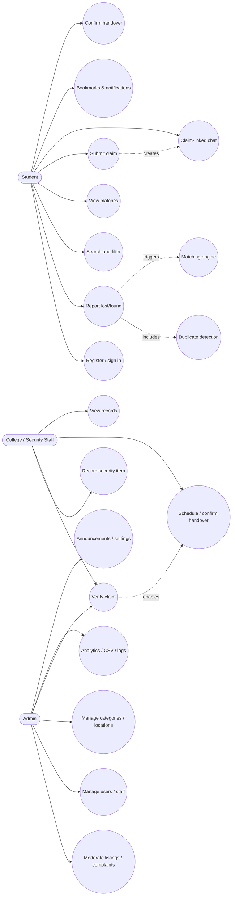
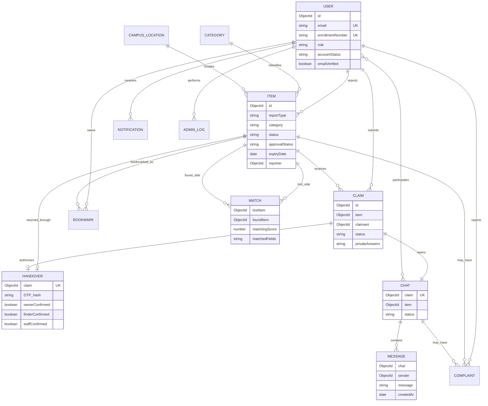
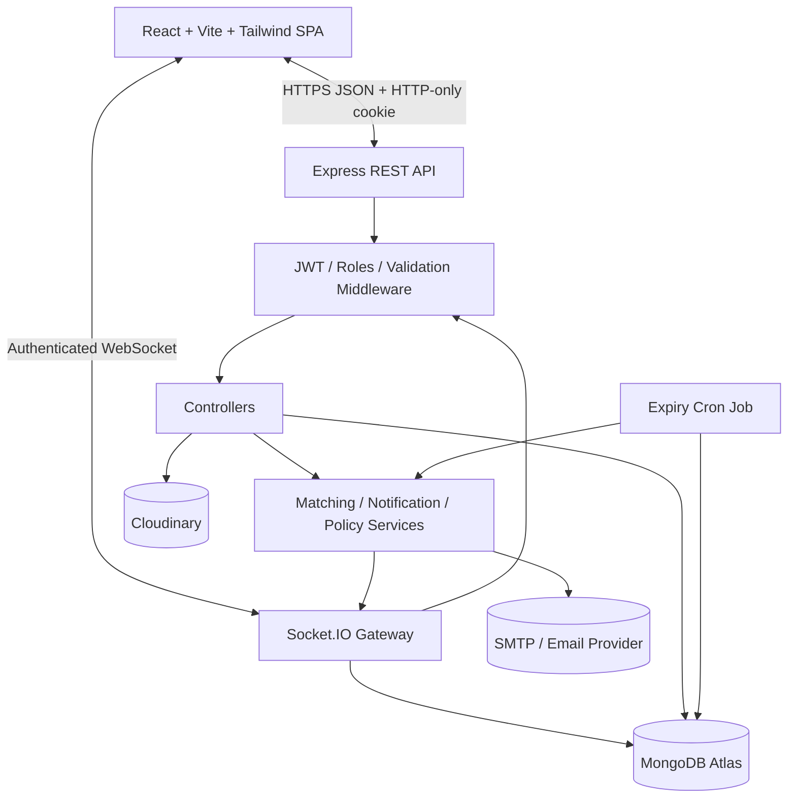
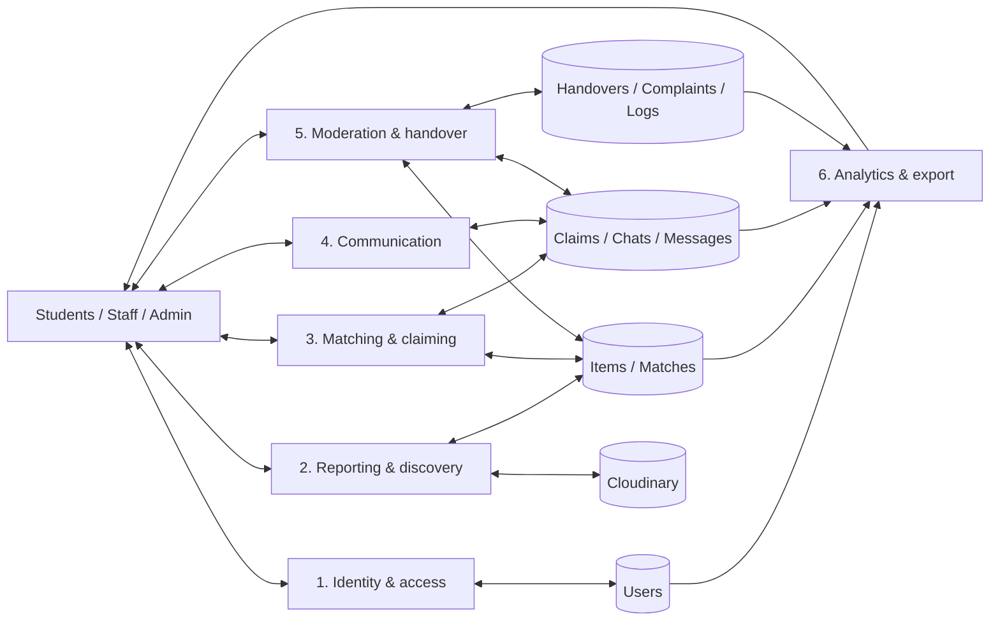
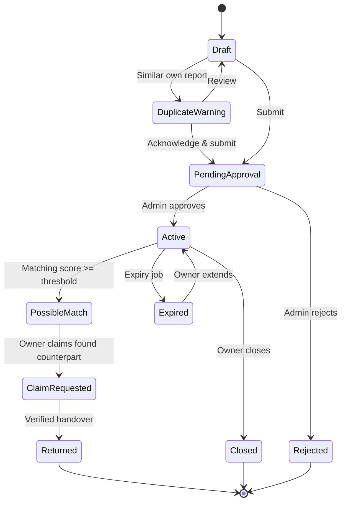
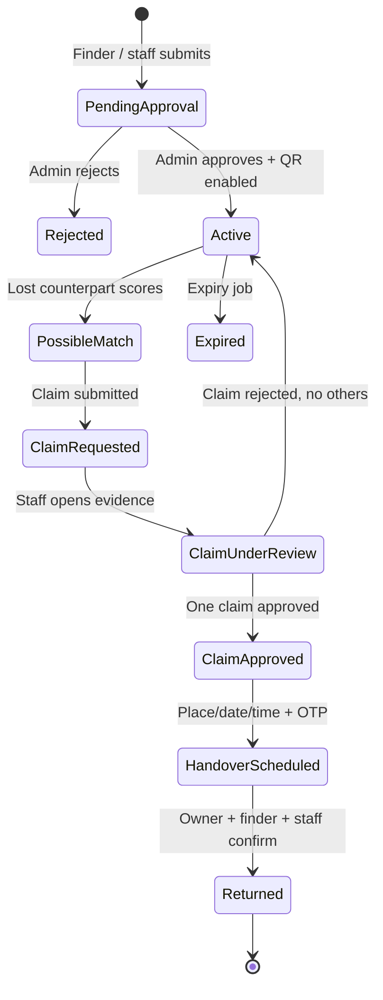
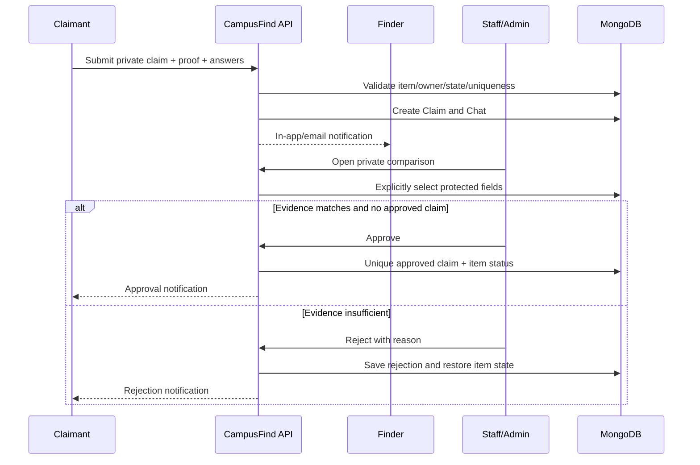
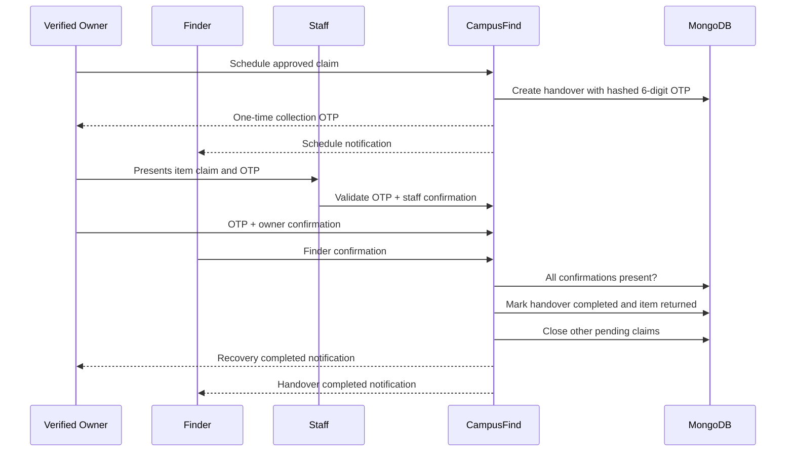

# CampusFind Mermaid diagrams

These blocks render in Mermaid-enabled Markdown viewers.

## Use-case diagram

## ER diagram

## System architecture

## Data-flow diagram

## Lost-item workflow

## Found-item workflow

## Claim approval workflow

## Handover workflow

